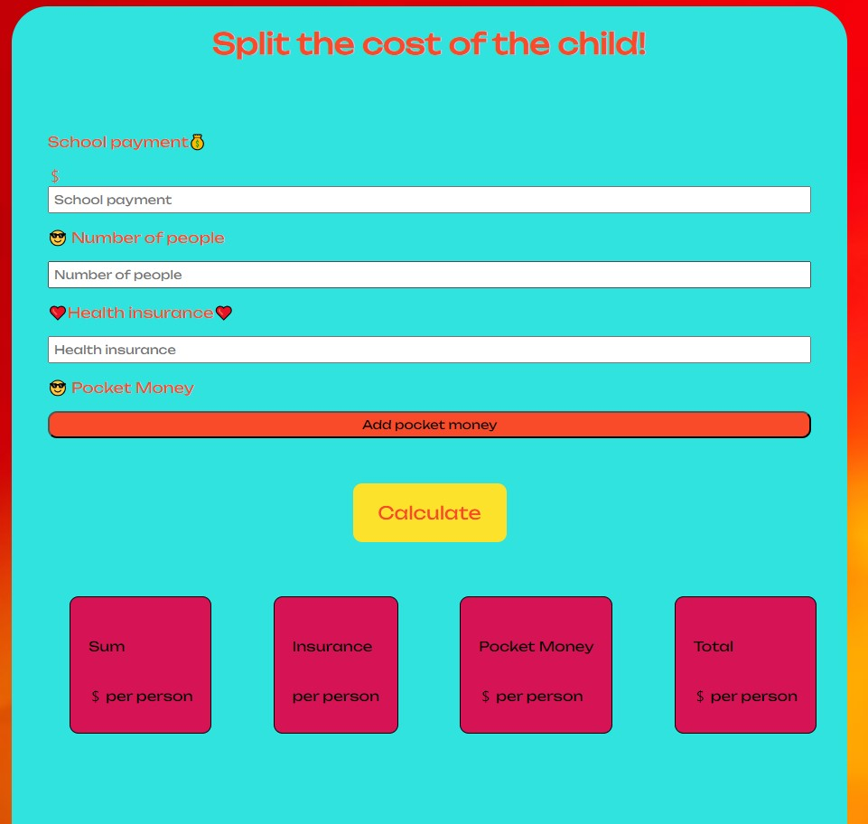

# Share the bill

 
Writing the project I used ___HTML/CSS and JavaScript.___
___
__What features does the application provide?__
* This application will help you calculate the expenses for child maintenance and divide them with your partner. 
* You can calculate the amount needed for education, medical insurance, and other expenses. 
* The app will calculate the total expenses and divide them by the number of people you specify.
